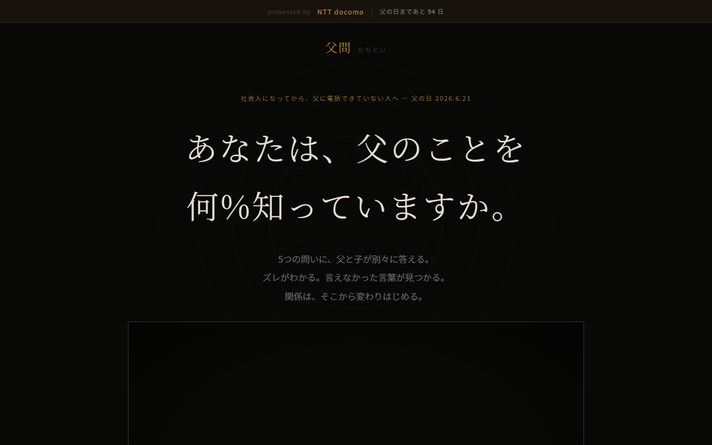
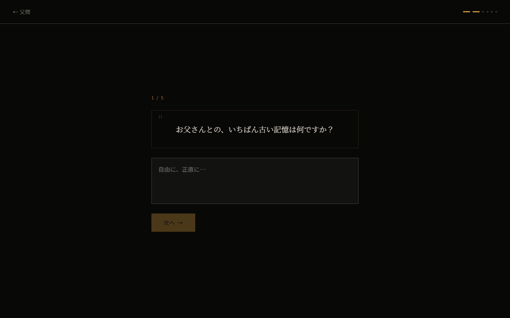
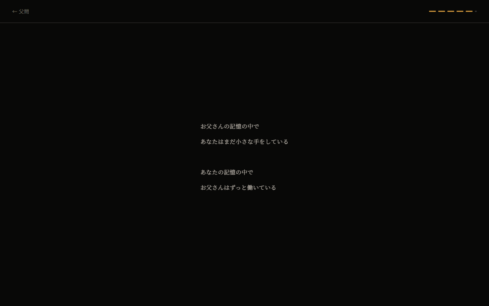
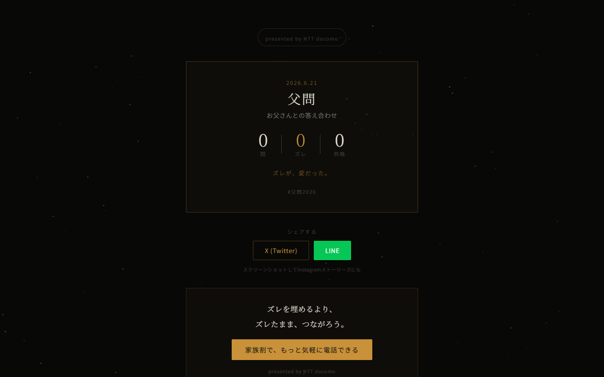
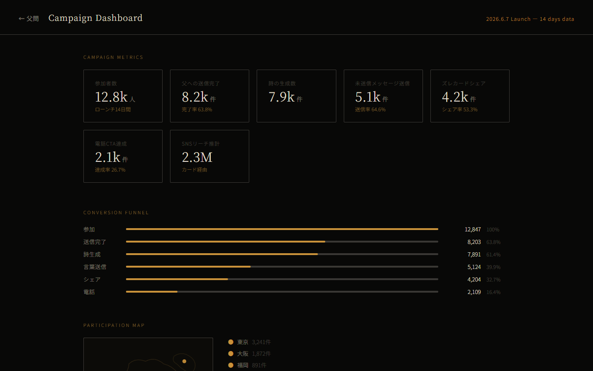

# 父問（ちちとい）

**ズレが、愛だった。**

父の日キャンペーン プロトタイプ — Dentsu Digital Creative 提案用

---

## コンセプト

父と子が、同じ5つの問いに「別々に」答える。

AIがふたりのズレを詩として読み解き、子が父に言いそびれていた言葉を一文で抽出する。
その言葉を、今日だけ届けられる。

> 「照れくさいから、何も言えなかったと思う」（子）  
> 「ありがとうと、毎朝、心の中で言っていた」（父）
>
> ズレが、愛だった。

---

## スクリーンショット

### ランディングページ



`/` — ヒーローコピー・カウントダウン・ピッチ動画

---

### デモ画面 — 問いに答える



`/demo` ステップ1 — 子が5問に答える画面

---

### デモ画面 — 父の答えが届く

`/demo` ステップ4 — 父の回答が一問ずつ出現、共鳴率バー

---

### デモ画面 — ズレを読む詩

`/demo` ステップ5 — AIが生成した詩が一行ずつフェードイン

---

### デモ画面 — 未送信の言葉

<!--  -->

`/demo` ステップ6 — AIが抽出した「言いそびれていた言葉」＋電話CTA

---

### ズレカード（Complete）



`/complete` — SNSシェア用カード、詩・スコア・docomo CTA

---

### キャンペーンデータ（Dashboard）



`/dashboard` — 参加者数・ファネル・都道府県マップ・スポンサー提案

---

## 5問の設計

| # | タイプ | 子への問い | 父への問い | ズレの種類 |
|---|--------|-----------|-----------|-----------|
| Q1 | 対称 | お父さんとの、いちばん古い記憶は？ | お子さんとの、いちばん古い記憶は？ | 時間軸のズレ（父は誕生から、子は記憶の始まりから） |
| Q2 | **非対称** | お父さんが言えなかった言葉は何だと思う？ | お子さんに言えなかった言葉はある？ | 想像と現実のズレ（コア） |
| Q3 | 対称 | 「家族」は何色？ | 「家族」は何色？ | 感じ方のズレ |
| Q4 | **非対称** | 父が泣くのを見たことがある？ | 最後に泣いたのはいつ？ | 孤独の可視化（父は一人で泣く） |
| Q5 | 対称 | 父から受け取った形のないものは？ | 子から受け取った形のないものは？ | 与え合いのズレ |

---

## 機能一覧

- **5問フロー** — 子が回答 → リンク送信 → 父が回答 → AI解析 → 詩生成
- **Gemini AI** — 父の回答生成・ズレの詩・未送信メッセージ抽出（25字以内）
- **共鳴率バー** — ふたりの答えの重なりを可視化
- **詩の音声読み上げ** — Web Speech API（日本語）
- **LINEシェア** — 未送信の言葉をそのまま送れる
- **ズレカード** — 結果をSNSシェア可能なカードとして表示
- **故人モード** — お父さんが亡くなっている場合、AIが記憶から答えを想像する。電話CTAなし、追悼テキストエリア表示
- **Remotionピッチ動画** — 60秒・7シーンのプレゼン用動画（ランディングに埋め込み）
- **キャンペーンダッシュボード** — 参加者数・ファネル・都道府県マップ・スポンサー提案

---

## セットアップ

```bash
cd chichikoe
npm install
npm run dev
```

ブラウザで `http://localhost:5173/dentsu/` を開く。

### Gemini APIキー（任意）

デモ画面の入力欄に [Google AI Studio](https://aistudio.google.com/) で取得したキーを入力。
空欄でもフォールバックデータでデモできます。キーはブラウザ内のみで使用され、外部送信されません。

---

## ビルド・デプロイ

```bash
cd chichikoe
npm run build
# dist/ が生成される
```

GitHub Actions（`.github/workflows/deploy.yml`）でmainブランチへのpush時に自動デプロイ。
公開URL: `https://takato180.github.io/dentsu/`

---

## ディレクトリ構成

```
chichikoe/
├── src/
│   ├── pages/
│   │   ├── Landing.tsx     # ランディングページ（ヒーロー・動画・About）
│   │   ├── Demo.tsx        # メインフロー（5問 → AI解析 → 詩 → CTA）
│   │   ├── Complete.tsx    # ズレカード・シェア・docomo CTA
│   │   └── Dashboard.tsx   # キャンペーンデータ・スポンサー提案
│   ├── remotion/
│   │   └── ChichikoePitch.tsx  # 60秒ピッチ動画（7シーン）
│   └── App.tsx             # ルーティング
├── public/
│   └── bgm.mp3             # バックグラウンドミュージック
└── vite.config.ts          # base: '/dentsu/'
```

---

## スポンサー想定

| スポンサー | KPI | 接点 |
|-----------|-----|------|
| **NTT docomo** | 電話CTA転換・家族割訴求 | 全画面スポンサーバー・電話ボタン・Complete CTA |
| 明治安田生命 | リード獲得 | 「家族の絆」文脈でのブランドリフト |
| サントリー プレモル | EC誘導 | 「父の日ギフト」文脈でのEC導線 |

---

## ブリーフ対応

電通ブリーフの評価軸への対応：

- **「新しい父の日体験」** — ギフト（モノ）ではなく、ズレ（会話）をギフトにする
- **「関係性がどう変わるか」** — 未送信メッセージのLINE送信・電話CTAが関係変化の証跡
- **「デジタルならではの体験」** — AI詩生成・非同期問答・シェア可能なズレカード
- **スポンサーブランドとの統合** — docomoの「家族割」が体験の締めとして自然に登場

---

presented by NTT docomo | 父問 — ズレが、愛だった。
